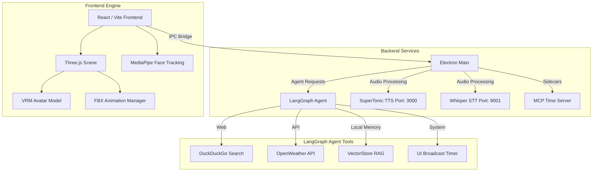

<div align="center">
  
  <h1>Athena - 3D VRM AI Assistant</h1>
  <p>A fully integrated, autonomous 3D AI companion driven by LangGraph, Electron, Three.js, and local AI microservices.</p>
</div>

---

## 🎯 Overview

Athena is an intelligent, emotionally responsive 3D avatar that lives on your desktop. Built for immersion and autonomy, Athena breaks out of the standard chatbox paradigm by featuring fully interactive 3D graphics driven by face-tracking, a localized RAG memory system, dynamic tool routing, and zero-latency local speech services.

### Core Capabilities
- 🧠 **LangGraph Agent Engine**: Powered by Google Gemini (and locally via Ollama), Athena acts as an agent, autonomously determining when to use tools.
- 🗣️ **Local Voice Stack**: Lightning-fast local inference using Python `whisper-fast` for Speech-to-Text and Node-based `SuperTonic` for Text-to-Speech.
- 👁️ **Face/Head Tracking**: MediaPipe integration allows Athena to look at you, maintain eye contact, and blink naturally based on your webcam.
- 🛠️ **MCP & Tools Integration**: Athena dynamically uses duckduckgo web search, weather APIs, system timers (linked to the 3D UI), and a local Model Context Protocol (MCP) sidecar for time data.
- 📚 **Localized Document RAG**: Drop PDFs into Athena's settings, and her `knowledge_search` tool will perform semantic vector searches against a local persistence store.

---

## 🏗️ Architecture

Athena utilizes a modular microservice architecture orchestrated via Electron IPC.



### Clean Architecture Principles
1. **No React Three Fiber**: The 3D scene is strictly imperative Three.js, decoupled entirely from the React render cycle for maximum performance.
2. **Local First**: Audio (STT/TTS) and document retrieval (RAG) execute locally via spawned background processes.

---

## 🚀 Getting Started

### Prerequisites

- Node.js 18+ (Recommended: Node 20 LTS)
- Python 3.10+ (for Whisper STT)
- ffmpeg (required by Whisper)

### Installation

```bash
# 1. Clone the repository
git clone <your-repo-url>
cd athena

# 2. Install root and electron dependencies
npm install

# 3. Install frontend renderer dependencies
cd renderer && npm install && cd ..
```

### Configuration

Create a `.env` file in the root directory and configure your keys:

```ini
# Required for Gemini LLM
GOOGLE_API_KEY="your-google-api-key"

# Required for Weather tool
OPENWEATHER_API_KEY="your-openweather-api-key"

# Optional overrides
ELECTRON_DISABLE_SANDBOX=1
```

> **Note**: You can also configure the AI Provider (Gemini, Ollama, LMStudio) and enter your API keys directly through the Athena UI Settings Panel.

### Required Assets

Ensure your 3D assets are placed correctly:

- **VRM Model:** `renderer/public/models/athena.vrm`
- **FBX Animations:** `renderer/public/animations/*.fbx` (using Mixamo standard rigs)

### Running the Application

Start all services (Frontend, Electron, STT, TTS, Agent) simultaneously:

```bash
npm start
```
*Note: Athena will automatically assign dynamic open ports to the STT and TTS background services to prevent collisions.*

---

## 📦 Project Structure

```text
athena/
├── backend/               # LangGraph Agent, RAG, MCP Manager, LLM Logic
├── electron/              # Main process, Preload scripts, IPC Bridge
├── renderer/              # Vite React Frontend
│   ├── public/            # Static assets (Models, FBX Animations)
│   └── src/
│       ├── components/    # React UI Components
│       ├── hooks/         # React Hooks (useAssistant, useFaceTracking)
│       └── three/         # Pure Three.js Engine (VRM, FBX Managers)
├── services/              # Local microservices
│   ├── stt-env/           # Python virtual environment
│   ├── whisper-fast/      # Python FastAPI for local STT
│   └── TTS-supertonic/    # Node.js local TTS engine
└── README.md
```

---

## 🛠️ Tool System (LangGraph)

Athena does not just answer queries textually; she executes functions autonomously.

1. **`knowledge_search(query)`**: Performs a cosine-similarity search against uploaded PDFs using `MemoryVectorStore`.
2. **`web_search(query)`**: Scrapes DuckDuckGo HTML results when external, up-to-date knowledge is required.
3. **`weather(city)`**: Calls the OpenWeather API.
4. **`timer(seconds)`**: An action-based tool that injects an IPC payload to render a 3D countdown timer in the frontend.
5. **`clock(timezone)`**: Calls an external MCP (Model Context Protocol) sidecar process to retrieve global time.

---

## 🎨 Modifying Athena

### Adding New Animations
1. Drop your `.fbx` (Mixamo Rigged) into `renderer/public/animations/`.
2. Update the `AnimationAction` enum in `renderer/src/three/AnimationManager.ts`.
3. Add the mapping to `ANIMATION_FILES`.

### Changing the LLM
Athena's factory supports hot-swapping providers. In the frontend Settings Dialog, simply switch the active provider to:
- **Gemini** (Cloud - `gemini-1.5-flash`)
- **Ollama** (Local - `dolphin-mistral`, `llama3`)
- **LM Studio** (Local - `http://localhost:1234/v1`)

---

## 🐛 Troubleshooting

- **Crash `EADDRINUSE`**: Fixed in v1.1. Athena now uses dynamic port resolution for the Python STT server and Node TTS server.
- **RAG Upload Errors**: Ensure `pdf-parse@1.x` is installed. `pdf-parse@2.x` is not supported by Langchain Community loaders.
- **Gemini Crash on Tool Execution**: Fixed in v1.1. ToolMessages now strictly pass the `name` field required by the `@langchain/google-genai` SDK.
- **Audio Device Errors**: Use the Settings panel inside Athena to explicitly set your target Microphone and Speaker interfaces.

---

<div align="center">
  <b>Built with ❤️ by Sameer Bagul</b>
</div>
