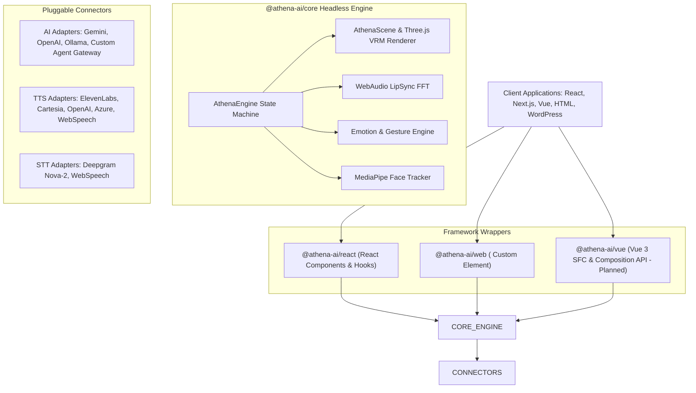

# 🤖 Athena 3D AI Agent SDK & Component Library

<div align="center">
  
  <h2>Industry-Grade 3D VRM AI Companion Engine & Multi-Framework Plugin Suite</h2>
  <p>Embed an interactive, talking 3D avatar powered by real-time WebAudio LipSync, face tracking, and multi-provider AI adapters into <b>React, Next.js, Vue, Svelte, Angular, WordPress, or HTML</b> in minutes.</p>

  <p>
    <a href="#-quickstart-integration"></a>
    <a href="#-packages-overview"></a>
    <a href="#-packages-overview"></a>
    <a href="#-connectors--provider-matrix"></a>
  </p>
</div>

---

## 📑 Table of Contents

- [✨ Core Capabilities & Specs](#-core-capabilities--specs)
- [🏗️ Modular Monorepo Architecture](#️-modular-monorepo-architecture)
- [📦 Packages Overview](#-packages-overview)
- [🔌 Connectors & Provider Matrix](#-connectors--provider-matrix)
- [⚡ How to Use the SDK](#-how-to-use-the-sdk)
  - [1. React / Next.js (`@athena-ai/react`)](#1-react--nextjs-athena-aireact)
  - [2. Framework-Agnostic Web Component (`@athena-ai/web`)](#2-framework-agnostic-web-component-athena-aiweb)
  - [3. Headless TypeScript Engine (`@athena-ai/core`)](#3-headless-typescript-engine-athena-aicore)
- [📖 API Reference](#-api-reference)
  - [`AthenaEngine`](#athenaengine)
  - [`<AthenaWidget />` (React)](#athenawidget--react)
  - [`<athena-agent>` (Web Component)](#athena-agent-web-component)
- [🛣️ Next Steps & Feature Roadmap](#️-next-steps--feature-roadmap)
- [🛠️ Building & Contributing](#️-building--contributing)
- [📄 License](#-license)

---

## ✨ Core Capabilities & Specs

- 🎭 **3D VRM Avatar Renderer**: Built on pure WebGL Three.js with async shader precompilation, frustum culling locks, and zero-stutter 60 FPS rendering.
- 🗣️ **WebAudio Spectral LipSync**: High-efficiency FFT audio formant analysis mapping real-time frequency data directly to VRM mouth blendshapes (`aa`, `ih`, `ou`, `ee`, `oh`).
- 🤖 **Universal AI Connectors**: Out-of-the-box adapters for **Google Gemini**, **OpenAI GPT-4o**, **Ollama**, and **Custom Agent Gateways** (FastAPI, Express, LangGraph, Python backends).
- 🎙️ **Multi-Engine TTS & STT**: Low-latency voice adapters for **ElevenLabs**, **Cartesia Sonic**, **OpenAI Audio**, **Azure Speech**, **Deepgram Nova-2**, and zero-cost **WebSpeech API**.
- 👁️ **Emotion & Gesture Controller**: Real-time sentiment detection updating facial expressions (`happy`, `sorrow`, `angry`, `surprised`, `relaxed`) with natural breathing, neck sway, and eye blinking.
- ⚡ **Zero-Dependency Headless Engine**: Core rendering and audio logic decoupled from UI frameworks.

---

## 🏗️ Modular Monorepo Architecture



---

## 📦 Packages Overview

This monorepo contains the published npm packages and showcase demo apps:

| Package | Version | Output Formats | Description |
|---|---|---|---|
| [`@athena-ai/core`](./packages/core) | `0.1.0` | ESM, CJS, `.d.ts` | Headless 3D VRM renderer, WebAudio LipSync engine, emotion manager, and provider connectors |
| [`@athena-ai/react`](./packages/react) | `0.1.0` | ESM, CJS, CSS, `.d.ts` | Production-ready React widget (`<AthenaWidget />`), UI drawer, voice fallback banner, and hooks |
| [`@athena-ai/web`](./packages/web) | `0.1.0` | ESM, CJS, IIFE Bundle | Framework-agnostic `<athena-agent>` Custom Element for CDN script tag embedding |
| [`demo-react`](./apps/demo-react) | Demo | App | Vite + React demonstration app consuming `@athena-ai/react` |
| [`demo-vanilla`](./apps/demo-vanilla) | Demo | App | Plain HTML demonstration app consuming `@athena-ai/web` |

---

## 🔌 Connectors & Provider Matrix

The SDK decouples AI, speech synthesis, and speech recognition into pluggable adapters.

### 1. AI / LLM Connectors
- **`GeminiAdapter`**: Google Gemini 1.5 Pro / 2.0 Flash streaming API.
- **`OpenAIAdapter`**: OpenAI GPT-4o, GPT-4o-mini, Groq, DeepSeek, and OpenRouter endpoints.
- **`OllamaAdapter`**: Local, zero-cost LLMs running on `http://localhost:11434`.
- **`CustomAgentAdapter`**: Connect any custom Python/Node REST or WebSocket agent server (FastAPI, Express, LangGraph).

### 2. Text-to-Speech (TTS) Connectors
- **`ElevenLabsTTSAdapter`**: High-fidelity, expressive synthetic voices.
- **`CartesiaTTSAdapter`**: Real-time ultra-low latency (<100ms) Cartesia Sonic TTS engine.
- **`OpenAITTSAdapter`**: OpenAI speech API (`tts-1` / `tts-1-hd`).
- **`AzureTTSAdapter`**: Microsoft Azure Cognitive Services Speech synthesis.
- **`WebSpeechTTSAdapter`**: Zero-cost browser speech synthesis fallback.

### 3. Speech-to-Text (STT) Connectors
- **`DeepgramSTTAdapter`**: Real-time WebSocket streaming audio transcription using Deepgram Nova-2.
- **`WebSpeechSTTAdapter`**: Native browser Speech Recognition (`webkitSpeechRecognition`).

---

## ⚡ How to Use the SDK

### 1. React / Next.js (`@athena-ai/react`)

Install `@athena-ai/core` and `@athena-ai/react`:

```bash
npm install @athena-ai/core @athena-ai/react
# or
pnpm add @athena-ai/core @athena-ai/react
```

Embed the 3D widget in your React app:

```tsx
import React from 'react';
import { AthenaWidget } from '@athena-ai/react';
import '@athena-ai/react/dist/style.css';

export default function App() {
  return (
    <div style={{ padding: '2rem' }}>
      <h1>My Web Application</h1>

      {/* Floating 3D AI Assistant Widget */}
      <AthenaWidget 
        avatarUrl="/models/athena.vrm"
        position="bottom-right"
      />
    </div>
  );
}
```

---

### 2. Framework-Agnostic Web Component (`@athena-ai/web`)

Works directly in **Vue, Svelte, Angular, WordPress, PHP, or Plain HTML**:

```html
<!DOCTYPE html>
<html lang="en">
<head>
  <meta charset="UTF-8" />
  <title>Athena 3D Agent</title>
  
  <!-- Import Web Component Bundle via CDN or Local Package -->
  <script type="module" src="https://cdn.jsdelivr.net/npm/@athena-ai/web/dist/index.js"></script>
</head>
<body>
  <h1>Welcome to my website</h1>

  <!-- Embedded Custom HTML Element -->
  <athena-agent 
    avatar-url="/models/athena.vrm"
    ai-provider="gemini"
    position="bottom-right">
  </athena-agent>
</body>
</html>
```

---

### 3. Headless TypeScript Engine (`@athena-ai/core`)

Use `@athena-ai/core` to build custom 3D avatars, custom UIs, or game integrations:

```typescript
import { 
  AthenaEngine, 
  GeminiAdapter, 
  ElevenLabsTTSAdapter,
  DeepgramSTTAdapter 
} from '@athena-ai/core';

// 1. Prepare HTML Canvas
const canvas = document.getElementById('avatar-canvas') as HTMLCanvasElement;

// 2. Instantiate Engine with Custom Adapters
const engine = new AthenaEngine({
  canvas,
  avatarUrl: '/models/athena.vrm',
  aiProvider: new GeminiAdapter({ apiKey: process.env.GEMINI_API_KEY! }),
  ttsProvider: new ElevenLabsTTSAdapter({ apiKey: process.env.ELEVENLABS_KEY! }),
  sttProvider: new DeepgramSTTAdapter({ apiKey: process.env.DEEPGRAM_KEY! }),
});

// 3. Initialize Engine
await engine.init('/models/athena.vrm');

// 4. Trigger Assistant Actions
engine.say("Hello! I am Athena. How can I help you today?");

// 5. Trigger Custom Expressions
engine.setEmotion('happy', 1.0);
```

---

## 📖 API Reference

### `AthenaEngine`

Main orchestrator class in `@athena-ai/core`.

```typescript
class AthenaEngine {
  constructor(options: AthenaEngineOptions);
  init(vrmUrl: string): Promise<void>;
  say(text: string): Promise<void>;
  ask(prompt: string): Promise<string>;
  listen(): void;
  stopListening(): void;
  setEmotion(emotion: VRMEmotion, weight?: number): void;
  destroy(): void;
}
```

### `<AthenaWidget />` (React)

| Prop | Type | Default | Description |
|---|---|---|---|
| `avatarUrl` | `string` | `"/models/athena.vrm"` | Path or URL to the 3D VRM avatar model |
| `position` | `"bottom-right" \| "bottom-left" \| "inline"` | `"bottom-right"` | Screen placement mode for the 3D widget |
| `aiProvider` | `AIProviderAdapter` | `GeminiAdapter` | Custom AI connector instance |
| `ttsProvider` | `TTSProviderAdapter` | `WebSpeechTTSAdapter` | Custom TTS connector instance |

### `<athena-agent>` (Web Component)

| Attribute | Type | Default | Description |
|---|---|---|---|
| `avatar-url` | `string` | `"/models/athena.vrm"` | URL to the VRM model |
| `ai-provider` | `"gemini" \| "openai" \| "ollama"` | `"gemini"` | Preset AI provider |
| `position` | `"bottom-right" \| "bottom-left"` | `"bottom-right"` | Screen positioning |

---

## 🛣️ Next Steps & Feature Roadmap

- [ ] **WebRTC Real-Time Audio Channels**: Integrate WebRTC channels for sub-50ms duplex voice streaming.
- [ ] **WebGPU In-Browser Whisper**: Add 100% offline transcription via `@xenova/transformers` in browser WebGPU.
- [ ] **Procedural Hand Gestures**: Retarget audio-amplitude-based hand gestures dynamically to VRM bone structures.
- [ ] **Vue & Svelte Native Packages**: Publish `@athena-ai/vue` and `@athena-ai/svelte` to NPM.
- [ ] **IndexedDB Asset Caching**: Cache `.vrm` and `.fbx` assets locally for instant repeat page loads.

---

## 🛠️ Building & Contributing

### Local Setup

```bash
# Clone repository
git clone https://github.com/Sameer-Bagul/athena.git
cd athena/athena-sdk

# Install monorepo dependencies
pnpm install

# Build all packages (@athena-ai/core, @athena-ai/react, @athena-ai/web)
pnpm build

# Run React Demo App
pnpm dev:react-demo

# Run Vanilla HTML Demo App
pnpm dev:vanilla-demo
```

---

## 📄 License

Distributed under the **MIT License**. See [`LICENSE`](./LICENSE) for details.

<div align="center">
  <b>Built with ❤️ by Sameer Bagul</b>
</div>
