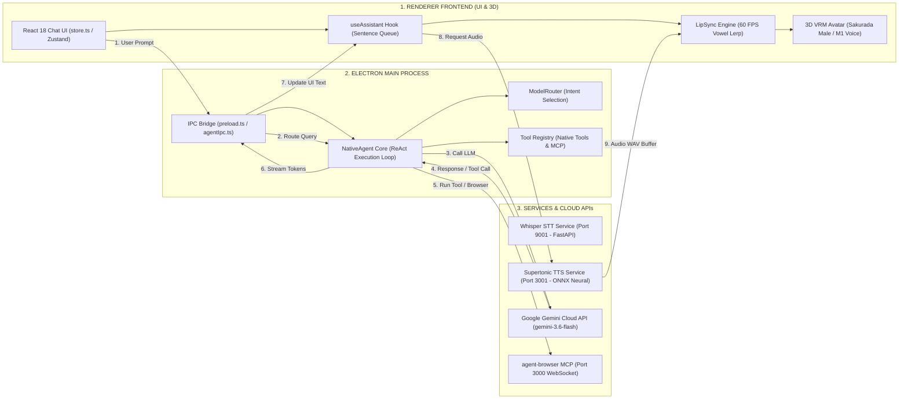
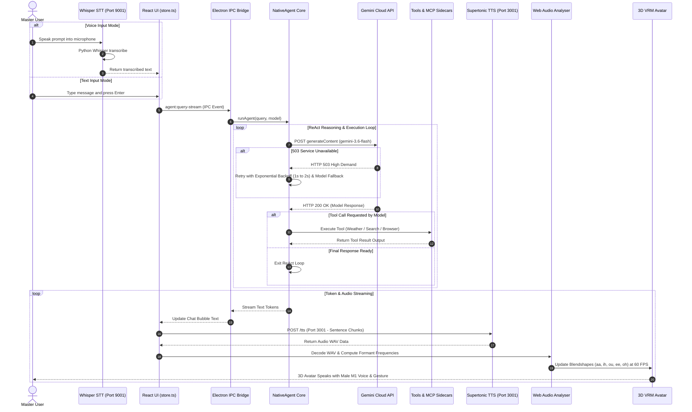
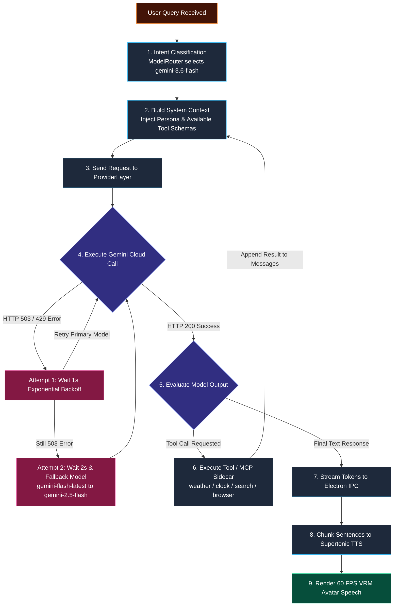
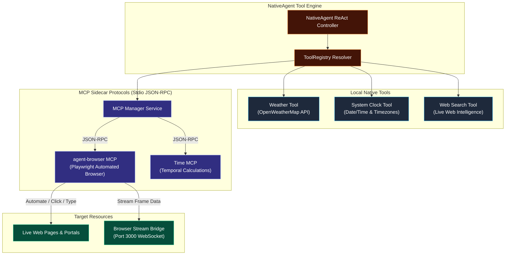

# Athena Architecture Documentation (Clean & Modular)

Welcome to Athena's clean, modular system architecture guide!

Unlike complex webs with overlapping arrows, Athena's architecture is presented in **5 clean, crystal-clear diagrams** with **zero line crossings or spaghetti arrows**.

---

## 1. Clean 3-Tier System Map (`clean_system_map.mmd`)

Organized into 3 distinct vertical columns (Frontend ➔ Desktop Main Process ➔ Services & Cloud APIs) with clean numbered arrows (1 to 9).

- **Mermaid File**: [`docs/architecture/clean_system_map.mmd`](file:///home/sameerbagul/Projects/Github/CV_Projects%F0%9F%A4%A9/athena/docs/architecture/clean_system_map.mmd)

---

## 2. Master End-to-End Sequence Flow (`grand_agent_sequence.mmd`)

A clean chronological sequence diagram detailing the complete lifecycle from input to LLM execution, 503 retries, tool execution, sentence token streaming, neural TTS generation, and 60 FPS VRM lip-sync.

- **Mermaid File**: [`docs/architecture/grand_agent_sequence.mmd`](file:///home/sameerbagul/Projects/Github/CV_Projects%F0%9F%A4%A9/athena/docs/architecture/grand_agent_sequence.mmd)

---

## 3. ReAct Loop & Multi-Model Fallback Resiliency (`clean_agent_loop.mmd`)

A step-by-step flowchart showing prompt reception, intent routing to `gemini-3.6-flash`, automatic 503 backoff retry (1s, 2s), model fallback chain, tool execution loop, and output streaming.

- **Mermaid File**: [`docs/architecture/clean_agent_loop.mmd`](file:///home/sameerbagul/Projects/Github/CV_Projects%F0%9F%A4%A9/athena/docs/architecture/clean_agent_loop.mmd)

---

## 4. 4-Step TTS & Lip Sync Pipeline (`clean_tts_lipsync.mmd`)

A 4-step horizontal pipeline showing how sentence text chunks generate neural WAV audio on Port 3001, and how Web Audio API formant energy analysis computes 60 FPS VRM mouth blendshapes (`aa`, `ih`, `ou`, `ee`, `oh`).

- **Mermaid File**: [`docs/architecture/clean_tts_lipsync.mmd`](file:///home/sameerbagul/Projects/Github/CV_Projects%F0%9F%A4%A9/athena/docs/architecture/clean_tts_lipsync.mmd)

```mermaid
graph LR
    subgraph Step1 ["1. Text Processing"]
        Text["Sentence Chunk<br/>Regex: [.!?]"]
    end

    subgraph Step2 ["2. Neural Audio Synthesis"]
        TTS["Supertonic TTS Server<br/>Port 3001 - ONNX Neural Voice"]
        WAV["WAV Audio Blob<br/>(24kHz / 16-bit Mono)"]
        Text -->|HTTP POST /tts| TTS
        TTS -->|Return Audio| WAV
    end

    subgraph Step3 ["3. Audio Analysis"]
        AudioCtx["Web Audio API<br/>AnalyserNode"]
        Formant["Formant Energy Filter<br/>Low, Mid, High Frequencies"]
        WAV -->|Decode Audio| AudioCtx
        AudioCtx -->|Frequency Array| Formant
    end

    subgraph Step4 ["4. 3D Render Loop"]
        Lerp["60 FPS Lerp Interpolation<br/>Factor: 0.4 Smooth Transition"]
        VRM["Sakurada VRM Avatar<br/>Blendshapes: aa, ih, ou, ee, oh"]
        Formant -->|Viseme Energy| Lerp
        Lerp -->|Set Morph Weights| VRM
    end

    classDef textStyle fill:#1e1b4b,stroke:#818cf8,color:#ffffff;
    classDef ttsStyle fill:#0284c7,stroke:#38bdf8,color:#ffffff;
    classDef audioStyle fill:#701a75,stroke:#f0abfc,color:#ffffff;
    classDef vrmStyle fill:#064e3b,stroke:#34d399,color:#ffffff;

    class Text textStyle;
    class TTS,WAV ttsStyle;
    class AudioCtx,Formant audioStyle;
    class Lerp,VRM vrmStyle;
```

---

## 5. Tools & MCP Sidecar Architecture (`mcp_tools_map.mmd`)

Detailed view of native tools (Weather, System Clock, Web Search) and stdio JSON-RPC MCP sidecars (Playwright agent-browser on Port 3000 stream bridge).

- **Mermaid File**: [`docs/architecture/mcp_tools_map.mmd`](file:///home/sameerbagul/Projects/Github/CV_Projects%F0%9F%A4%A9/athena/docs/architecture/mcp_tools_map.mmd)

---

## Interactive HTML Viewer

Open [`docs/architecture/viewer.html`](file:///home/sameerbagul/Projects/Github/CV_Projects%F0%9F%A4%A9/athena/docs/architecture/viewer.html) in your web browser to interactively switch between all **5 clean architecture diagrams** in a dark-mode, glassmorphism interface!
