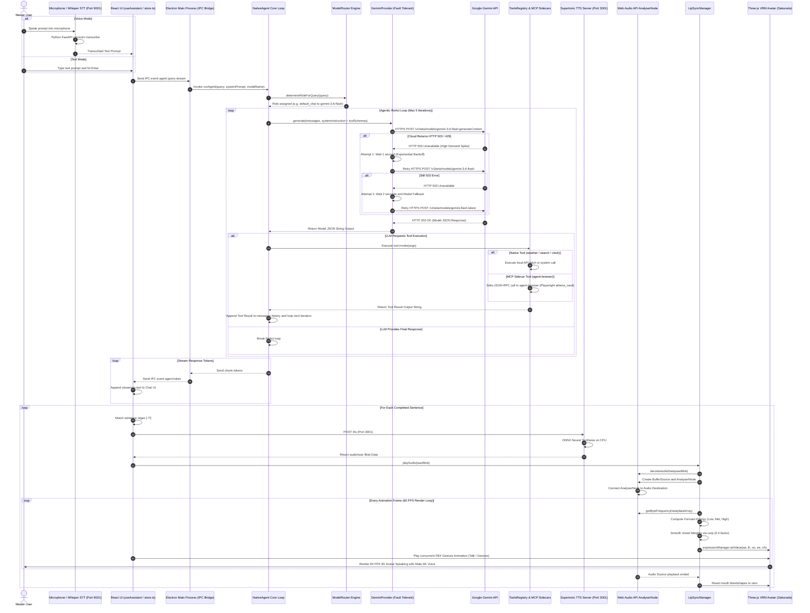

# Athena GRAND Master Architecture

Welcome to the comprehensive architecture guide for **Athena**!

---

## 1. GRAND Master Architecture Flowchart (`grand_master_architecture.mmd`)

This flowchart details all 7 system layers, color-coded subgraphs, microservice ports, IPC communication, and resilient cloud API execution.

- **Mermaid Source**: [`docs/architecture/grand_master_architecture.mmd`](file:///home/sameerbagul/Projects/Github/CV_Projects%F0%9F%A4%A9/athena/docs/architecture/grand_master_architecture.mmd)

```mermaid
flowchart TB
    classDef inputStyle fill:#1e1b4b,stroke:#818cf8,stroke-width:2px,color:#ffffff;
    classDef uiStyle fill:#064e3b,stroke:#34d399,stroke-width:2px,color:#ffffff;
    classDef audioStyle fill:#701a75,stroke:#f0abfc,stroke-width:2px,color:#ffffff;
    classDef mainStyle fill:#1e293b,stroke:#94a3b8,stroke-width:2px,color:#ffffff;
    classDef agentStyle fill:#431407,stroke:#fb923c,stroke-width:2px,color:#ffffff;
    classDef providerStyle fill:#312e81,stroke:#a5b4fc,stroke-width:2px,color:#ffffff;
    classDef serviceStyle fill:#0284c7,stroke:#38bdf8,stroke-width:2px,color:#ffffff;
    classDef cloudStyle fill:#831843,stroke:#f472b6,stroke-width:2px,color:#ffffff;

    subgraph Layer_Input ["1. User Input and Voice Capture Layer"]
        Mic["Microphone Input (Audio Stream)"] :::inputStyle
        Keyboard["Keyboard Text Input (Chat Box)"] :::inputStyle
        Hotkey["Global Hotkey (Alt+Space Push-to-Talk)"] :::inputStyle
    end

    subgraph Layer_Renderer ["2. Frontend Renderer Process (Vite + React + Three.js)"]
        ChatUI["React 18 Chat Interface<br/>(Zustand Store / store.ts)"] :::uiStyle
        AssistantHook["useAssistant Hook<br/>(Sentence Buffer and Queue)"] :::uiStyle
        
        subgraph Sub_Avatar ["3D Avatar and Audio Engine"]
            ThreeStage["ThreeStage Component<br/>(Canvas and Scene Setup)"] :::audioStyle
            VRMModel["Three.js VRM Avatar Model<br/>(Sakurada Male / M1 Voice)"] :::audioStyle
            AnimMgr["AnimationManager<br/>(FBX Skeletal Animations and Gestures)"] :::audioStyle
            LipSync["LipSyncManager<br/>(Web Audio API AnalyserNode)"] :::audioStyle
            FormantEngine["Formant Energy Viseme Engine<br/>(60 FPS Lerp: aa, ih, ou, ee, oh)"] :::audioStyle
        end
    end

    subgraph Layer_Electron ["3. Electron Main Process and Desktop Window Manager"]
        IPCBridge["Preload IPC Bridge<br/>(preload.ts - ContextBridge)"] :::mainStyle
        MainThread["Electron Main Entry<br/>(electron/main.ts)"] :::mainStyle
        WindowManager["Window Manager<br/>(1080p Main Window and Mini Widget)"] :::mainStyle
        StateSync["Sync Broadcasting<br/>(Main Window and Widget Sync)"] :::mainStyle
    end

    subgraph Layer_Agentic ["4. Autonomous Agentic AI Core"]
        NativeAgent["NativeAgent ReAct Loop<br/>(backend/agent/nativeAgent.ts)"] :::agentStyle
        ModelRouter["Intent Model Router<br/>(planner | coder | browser | default_chat)"] :::agentStyle
        PromptBuilder["System Prompt Builder<br/>(Inject Persona and Tool Schemas)"] :::agentStyle
        
        subgraph Sub_Tools ["Tool Registry and MCP Integration"]
            ToolRegistry["Native Tools Registry<br/>(weather, clock, web_search, python)"] :::agentStyle
            MCPManager["MCP Sidecar Manager<br/>(mcpManager.ts - Stdio JSON-RPC)"] :::agentStyle
            RAGService["RAG Vector Store<br/>(ragService.ts - Document Search)"] :::agentStyle
        end
    end

    subgraph Layer_Providers ["5. AI Provider Layer and Fault Tolerance"]
        ProviderFactory["getAIProvider Factory<br/>(providerLayer.ts)"] :::providerStyle
        GeminiProvider["GeminiProvider<br/>(Cloud Execution)"] :::providerStyle
        RetryHandler["503/429 Exponential Backoff<br/>(1s, 2s Retries and Backoff)"] :::providerStyle
        ModelFallback["Multi-Model Fallback Chain<br/>(3.6-flash to flash-latest to 2.5-flash)"] :::providerStyle
        OllamaProvider["OllamaProvider<br/>(Local Execution - dolphin-mistral)"] :::providerStyle
    end

    subgraph Layer_Services ["6. Dedicated Local Microservices and Sidecars"]
        STTServer["Whisper STT Server<br/>(Port 9001 - Python FastAPI)"] :::serviceStyle
        TTSServer["Supertonic TTS Server<br/>(Port 3001 - Node ONNX Neural TTS)"] :::serviceStyle
        BrowserBridge["Agent Browser WebSocket<br/>(Port 3000 - Live Stream Bridge)"] :::serviceStyle
        BrowserMCP["agent-browser MCP Sidecar<br/>(Playwright + athena_vault Session)"] :::serviceStyle
        TimeMCP["Time MCP Sidecar<br/>(Temporal Calculations)"] :::serviceStyle
    end

    subgraph Layer_Cloud ["7. External Cloud Services and APIs"]
        GoogleAPI["Google Gemini Cloud API<br/>(generativelanguage.googleapis.com)"] :::cloudStyle
        OpenWeather["OpenWeatherMap API<br/>(Weather Data)"] :::cloudStyle
        WebSearchAPI["Web Search Engine<br/>(Live Internet Intel)"] :::cloudStyle
    end

    Mic -->|Audio Buffer| STTServer
    STTServer -->|Transcribed Text| ChatUI
    Keyboard -->|Text Prompt| ChatUI
    Hotkey -->|Trigger Wake PTT| MainThread

    ChatUI -->|Submit Message| AssistantHook
    AssistantHook -->|IPC: agent:query-stream| IPCBridge
    IPCBridge -->|Forward Request| MainThread
    MainThread -->|Delegate Query| NativeAgent

    WindowManager --> StateSync
    StateSync -->|Broadcast UI State| ChatUI

    NativeAgent -->|1. Classify Intent| ModelRouter
    ModelRouter -->|2. Assign Model| NativeAgent
    NativeAgent -->|3. Assemble Context & Tool Schemas| PromptBuilder
    PromptBuilder -->|4. Request Generation| ProviderFactory
    
    ProviderFactory --> GeminiProvider
    ProviderFactory --> OllamaProvider
    GeminiProvider -->|HTTPS POST| GoogleAPI
    GoogleAPI -.->|503 High Demand Error| RetryHandler
    RetryHandler -->|Exponential Wait and Retry| GeminiProvider
    RetryHandler -.->|Fallback Model| ModelFallback
    ModelFallback -->|Retry Alternate Candidate| GoogleAPI

    NativeAgent -->|5. Check / Execute Tools| ToolRegistry
    ToolRegistry -->|Query Weather| OpenWeather
    ToolRegistry -->|Query Search| WebSearchAPI
    ToolRegistry -->|Query Documents| RAGService
    NativeAgent -->|Execute MCP Sidecars| MCPManager
    MCPManager -->|Stdio JSON-RPC| BrowserMCP
    MCPManager -->|Stdio JSON-RPC| TimeMCP
    BrowserMCP -->|Live Stream| BrowserBridge

    NativeAgent -->|6. Stream Response Tokens| MainThread
    MainThread -->|IPC agent:token| IPCBridge
    IPCBridge -->|Render Streaming Text| AssistantHook
    AssistantHook -->|Chunk Completed Sentences| AssistantHook
    AssistantHook -->|HTTP POST /tts Port 3001| TTSServer
    TTSServer -->|Return WAV Audio Blob| AssistantHook

    AssistantHook -->|Play Audio Blob| LipSync
    LipSync -->|Audio Buffer Source| FormantEngine
    FormantEngine -->|Compute Vowel Energy Low/Mid/High| FormantEngine
    FormantEngine -->|Set Blendshapes aa, ih, ou, ee, oh| VRMModel
    AssistantHook -->|Trigger Motion Gesture| AnimMgr
    AnimMgr -->|Apply FBX Skeleton Keyframes| VRMModel
    ThreeStage -->|Render 60 FPS Canvas| VRMModel
```

---

## 2. GRAND End-to-End Sequence Diagram (`grand_agent_sequence.mmd`)

This sequence diagram details the full interaction cycle from input to intent routing, Gemini cloud execution, 503 exponential backoff retries, tool execution, token streaming, Supertonic TTS synthesis (Port 3001), Web Audio API formant analysis, and 60 FPS VRM avatar rendering.

- **Mermaid Source**: [`docs/architecture/grand_agent_sequence.mmd`](file:///home/sameerbagul/Projects/Github/CV_Projects%F0%9F%A4%A9/athena/docs/architecture/grand_agent_sequence.mmd)



---

## 3. Interactive Web Viewer (`viewer.html`)

Open [`docs/architecture/viewer.html`](file:///home/sameerbagul/Projects/Github/CV_Projects%F0%9F%A4%A9/athena/docs/architecture/viewer.html) in your browser for tabbed dark-mode rendering of all diagrams.
